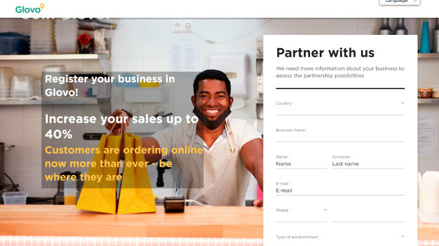

      
  
<em>Glovo <strong>are no longer</strong>operating in Ghana.</em>

      
Well, well, well, there is a new big delivery player in the industry and it's Glovo.

      
If you're in Accra and haven't heard <a href="https://about.glovoapp.com/en/" target="_blank" rel="noreferrer"> about Glovo app</a> yet, 
        then you are probably living under a rock.

      
Glovo's marketing and communication team have literally covered every 
      screen and street with their ads and you can tell they are in for the long haul.

      <h2>What is Glovo?</h2>
      
Glovo is the delivery app that lets users order food and drinks from 
       their mobile phones and get them delivered to their doorstep.

      
Glovo Ghana app goes a bit further by letting users order <em>"anything"</em> as long as it fits into their Glovo bags.

      
Glovo is a Spanish company and are currently located in over 15 countries worldwide.

  
To start enjoying their services, you first need to download their app.

      
Below are the links:

      <ul>
       <li><a href="https://play.google.com/store/apps/details?id=com.glovo" target="_blank" rel="noreferrer">Glovo Food App (Android)</a></li>
       <li><a href="https://apps.apple.com/app/id951812684?mt=8" target="_blank" rel="noreferrer">Glovo Food App (iOS)</a></li>
      </ul>

  <h2>Why Should I Use Glovo App?</h2>
      
Yes, it's true there are other food delivery businesses in Accra you can use to order your food and drinks.

      
There is <a href="bolt-food-ghana">Bolt Food</a>, Jumia Food, ShopNaw App, Pizarea and slew of other apps, 
      but here are why reasons you should try Glovo.

      <ul>
       <li>Glovo's delivery prices are relatively low. You get to pay 
       Ghc 3 - Ghc 6 delivery fees for restaurants within your location.</li>
       <li>They have an array of restaurants listed on their platform. 
       You get a lot of options to choose from.</li>
       <li>Glovo Ghana app has great deals with restaurants 
       which makes users get good discounts on food items.</li>
       <li>Glovo is widely available - Accra and now in Tema</li>
       <li>Their app is really simple, fast and easy to use.</li>
      </ul>

  <h2>Any Glovo Ghana Promo Code for the Boys and Girls?</h2>
      
Yes, Glovo Ghana occasionally gives out promo code to its users. 
      Make sure you regularly open your Glovo emails for the promo codes.

      
Meanwhile...

      
Use this code, <strong>NAMY9XJ</strong> to get Ghc 20 off your first order.

      
Their deliveries are fast and you get to track your delivery rider.

      
So you now know all about Glovo Food app, now go ahead and make your first order.

      
Don't forget to use the Glovo code above.

  <h2>Some Restaurants on Glovo Ghana</h2>
      
There are loads of popular and new restaurants on Glovo, serving food ranging
       from pancakes, burgers, pizzas to drinks.

      
Here are some restaurants on Glovo:
 
      <ul>
       <li>Cheezzy Pizza</li>
       <li>Starbites</li>
       <li>Papa's Pizza</li>
       <li>Zongo Flavor</li>
       <li>Burger King</li>
       <li>Zoozoo Restaurant</li>
       <li>Mama Put Ghana</li>
       <li>Doughman</li>
       <li>Eddys Pizza</li>
      </ul>
 
  
Share this with your WhatsApp friends and Group

      

       
      

  <h2>Join or Get Your Restaurant on Glovo App (Ghana) </h2>
      
      
To join Glovo Ghana App as a partner restaurant, all you have to do is fill out their 
      application form on their website.

      
Visit <a href="https://cloud.partner.glovoapp.com/Partners" target="_blank" rel="noreferrer"> https://cloud.partner.glovoapp.com/Partners</a> to register 
      as a restaurant, shop partner or a driver.

     