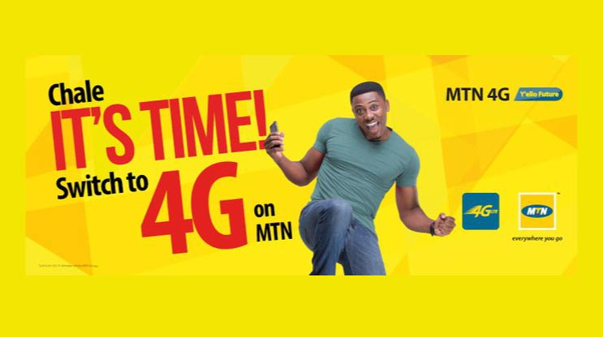

  
   
  
<strong>Quick Tip: To enjoy MTN Ghana's 4G Data plan, just dial the MTN 4G code *138#, 
      select <em>Internet Packs</em>, and choose your package.</strong>

      
You immediately get 50% bonus on every data bundle you subscribe to when you switch to MTN Ghana's 4G

      
Read more below...

      

      
Mobile phones are now more common than ever before, with majority of
        Ghanaian adults owning a phone or two.

      
These days, connecting to the internet via a mobile phone is not only important,
        but also very necessary.

      
From sending and receiving messages, making phone calls to checking news
        updates, the internet has now become part of us.

      
That's why it is also essential to connect online using efficient and faster ways.

      
Here comes MTN's 4G LTE (Long Term Evolution) mobile network.

      <h2>What is 4G?</h2>
      
4G is a 4 generation mobile network technology with a
       much faster speed than 2G and 3G.

      
Currently, most Ghanaian mobile phone users are on 2G and 3G networks,
        which is okay but we believe you need a faster way of connecting to the
        internet on your smartphones.

      
Below are 5 reasons why you should switch to MTN's 4G LTE.

      <h2>1. Faster Data Speed</h2>
      
MTN's 4G data speed is incredibly fast. And this makes downloading of music and
        movies, watching YouTube videos and making video/voice calls on WhatsApp very fast and smooth.

      
With MTN's 4G, you won't have to go through the stress of buffering and
        waiting for data connection when online. It is a smooth experience.

      
And I bet you on this one, once you use MTN's 4G network,
        you are not likely to return to their/any other 2G/3G/3.5G network. It's kind of like
        returning to snail mail after using email.

      <blockquote>Popular Post: <a href= "pay-for-android-apps-mtn-mobile-money"><em>How to Buy 
       Apps and Games Using MTN Mobile Money on Google Play Store </em></a>
      </blockquote>
      <h2>2. Same Price</h2>
      
In certain countries, network providers charge a higher price for 4G.

      
That's because they consider 4G to be a premium network and therefore
        put a higher price tag on it. That's not the same for MTN Ghana, they want more customers
        to be on their 4G network at the normal data charges.

      
The price you pay to subscribe for a 500MB data bundle on MTN Ghana's 4G network
        is the same price you pay to subscribe for same data bundle on their 3G service.

      
So why not switch to a faster one? MTN won't charge you extra for using their
        4G network. During their 4G LTE promo, 4G data subscribers were given 100% data
        bonus on every data bundle purchased. It's currently down to 50% bonus.

      <h2>3. MTN won't eat into your Main Credit</h2>
      
It's true that 4G is fast and because of that you are more likely to
        stream more music and videos.

      
MTN knows this and because of that they don't touch your main credit when you
        use up your subscribed data bundle.

      
With this, you don't have to panic when you are watching a YouTube video and you
        exhaust your data bundle. Your main credit will always be safe.

      
This is a good feature that the other networks in Ghana could emulate
       regardless of whether they are offering  4G service or not.

      
To allow your main credit to be used for your data browsing, dial *138#, choose
        option 5 and give your consent.

      <h2>4. Convenience</h2>
      
MTN Ghana is currently the <del>only</del> mobile network operator in Ghana that provides 4G
        service. AirtelTigo and Glo do not offer 4G. <a href="vodafone-ghana-4g">Vodafone Ghana now offers 4G internet</a> service.

      
This means that with MTN, you get faster internet speed on the go. No need
        to be carrying a portable mobile Wi-Fi device with you all the time.

      <h2>5. Share your internet data with other devices</h2>
      
MTN Ghana allows you to share your 4G data with other devices. This can be
        achieved by using your mobile phone as a mobile hotspot.

      <h2>Connect to MTN's 4G</h2>
      
Connecting to MTN 4G LTE is a pretty straightforward process. If you are
        using a smartphone, you can check if your phone is compatible by dialling *585#, if
        the prompt says your device is compatible, just head to any MTN shop to get
        a 4G sim card. Their personnel will help you set it up.

      
<strong>My phone is not compatible</strong>

      
If you check and your phone is not supported, you will have to buy a
       4G device that supports MTN's 4G. We are currently preparing
       a list of affordable 4G smartphones under 500 Ghana Cedis.

      
<em>Kindly bookmark this page or sign up to our newsletter so you
      can read our review when we finish preparing the list.</em>

      <h2>MTN 4G Data Plan - Ghana</h2>
      
To enjoy MTN Ghana's 4G Data plan, just dial the MTN 4G code *138#, 
      select <em>Internet Packs</em>, and choose your package.

      
You can bundle for daily, weekly, monthly, video and other plans.

      
If you can stay up throughout the early hours of the morning, 
       you should choose one of the Midnight bundles - you get 5GB of MTN 4G data for only 3 Ghana Cedis.

      
If you need to update some software or do Netflix and Chill, 
        you can always choose a Midnight bundle.

  <h2>Cons</h2>
      
It's great that you can access MTN's 4G on the go, but currently,
       the service is not available everywhere in Ghana.

      
MTN's 4G is available in most of our major cities though, and the good
        thing is that they are currently expanding.

      
There are also a few locations where MTN's 4G switches to 3G because 4G
       is not accessible.

      
But all in all, we urge you to try MTN's 4G sim. If you are
      not satisfied (which we doubt), you can always change your
      phone's settings to 3G or 2G (I'm  kidding, don't ever change to 2G
      if either 3G or 4G is available).

      
Meanwhile, you may find out about other 4G data operators in Ghana such as Surfline, Blu, Telesol etc.
