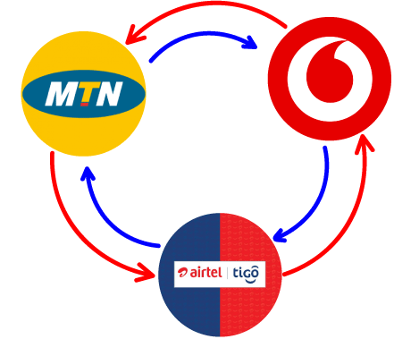

  
     
  

Mobile money interoperability is finally here. The Ghana Interbank Payment
         and Settlement Systems (GhIPSS) has at long last completed the system
         that ensures cross-network mobile money transactions.

      <h2>What is mobile money interoperability?</h2>
      
It is a system that allows customers to transfer money between two mobile
        money accounts belonging to different mobile money operators or between
        a mobile money account and a bank account.

      
<strong>This simply means that:</strong>

      
Mobile money subscribers in Ghana can now easily transfer money from their current network operator to
        any other network operator (<em>excluding Glo Ghana</em>).

      
<strong>No need to download any app or visit any agent. Send/receive money directly</strong>

      
In Practice: if you use MTN Mobile Money, you can send money to and
        receive money from any other network, be it Vodafone Cash or AirtelTigo Money.

      
<strong>For example:</strong>

      <h2>Transfer money from MTN Mobile Money account to Vodafone Cash account</h2>
      
1. Dial MTN Mobile Money short code: *170# 

      
2. Select <em>Transfer Money</em>

      
3. Choose <em>Other Networks</em>

      
4. Select the Network <em>e.g. Vodafone</em>

      
5. Enter the person's phone number, confirm number

      
6. Type the Amount

      
7. Enter Reference

      
8. And enter your PIN

      
That's it, mobile money transfer transaction is completed. Easy as cake.

  <h2>Send Money from Vodafone to MTN or AirtelTigo </h2>
      
Dial Vodafone Cash short code *110#, choose <em>Send Money</em>, select <em>Other Networks</em>, 
       choose the network operator and follow prompts. 

      <h2>Send Money from AirtelTigo to MTN or Vodafone </h2>
      
Dial AirtelTigo Money short code *110#, choose <em>Send Money/Cash</em>, select <em>To Mobile Number</em>, choose <em>Other 
        Networks</em> and follow prompts. 

  <h2>How to Transfer Credit from MTN to Vodafone</h2>
      
To do this, you have to first transfer money from MTN to Vodafone and 
       then use the money received in the Vodafone wallet to buy airtime.
   
      
If you never liked mobile money in the past, it's now more important to
        start using mobile money because of its interoperability.

        
  
Note: Various charges apply.   For MTN users: Should you see 'msisdn' prompt 
      on your screen it's simply asking for a mobile phone number.

   <blockquote>Popular Post: <a href= "pay-for-android-apps-mtn-mobile-money"><em>How to Buy 
       Apps and Games Using MTN Mobile Money on Google Play Store </em></a>
      </blockquote>

  